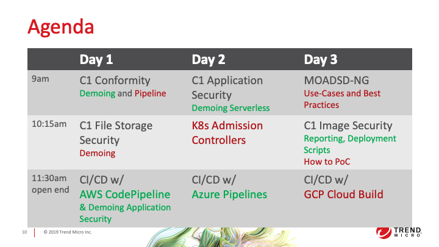

# DevOps Intermediate Training

## Course Description

The DevOps Intermediate Training is a three days instructor led course. Participants will learn how to demo Trend Micro Cloud One security services from a DevOps perspective. The course discusses automation using continuous integration and delivery (CI/CD) pipelines using AWS CodePipeline, Azure Pipelines and GCP Cloud Build. This course incorporates a variety of hands-on lab exercises, allowing participants to put the lesson content into action.

## Target Audience

Sales Engineers

## Prerequisites

Participants must have experience with the topics of the DevOps Foundation Training prior to attending the DevOps Intermediate course. Especially, profound experience with Containers, Kubernetes and CI/CD Pipelines is required.
Participants are required to bring a laptop computer with a recommended screen resolution of at least 1980 x 1080 or above.
Important: Valid subscriptions for AWS, GCP and Azure are required.

## Course Objectives

After completing this training course participants will be able to:

- Demo Cloud One within the three major public cloud platforms (AWS, GCP & Azure)
- Demo and understand Cloud One Application Security, Conformity, File Storage Security and Container Security

## Training Topics

- Demoing Cloud One Conformity
- Demoing Cloud One File Storage Security
- Demoing Cloud One Application Security (applications and serverless)
- CI/CD w/AWS CodePipeline
- CI/CD w/Azure Pipelines
- CI/CD w/GCP Cloud Build
- Demoing Container Security
- K8s Admission Controllers
- MOADSD-NG Use cases and Best Practices
- Cloud One Smart Check – Reporting and How to PoC

## Agenda

