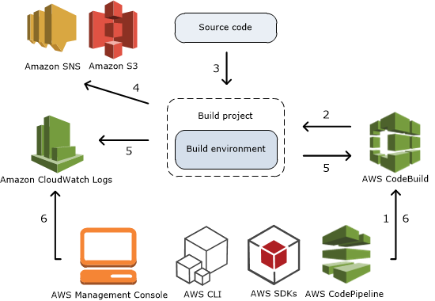
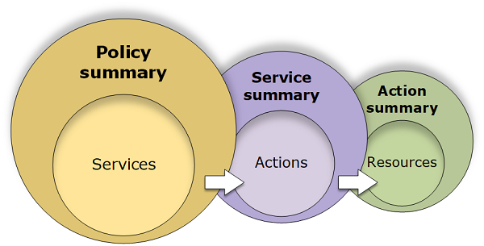
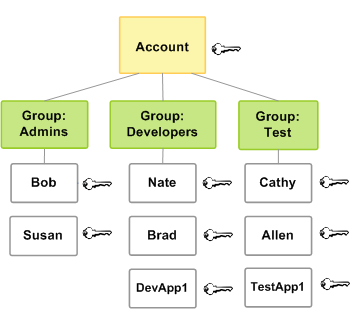

# AWS Theory

- [AWS Theory](#aws-theory)
  - [Services - Container](#services---container)
    - [EKS](#eks)
    - [ECR](#ecr)
    - [ECS](#ecs)
    - [Fargate](#fargate)
  - [Services - Serverless](#services---serverless)
  - [Services - DevOps](#services---devops)
    - [CodeCommit](#codecommit)
    - [CodeArtifact](#codeartifact)
    - [CodeBuild](#codebuild)
      - [Build specification](#build-specification)
    - [CodeDeploy](#codedeploy)
    - [CodePipeline](#codepipeline)
  - [Knowledge - IAM](#knowledge---iam)
    - [Principal](#principal)
    - [Request](#request)
    - [Authentication](#authentication)
    - [Authorization](#authorization)
    - [Actions or Operations](#actions-or-operations)
    - [Resources](#resources)
    - [Instance Profiles](#instance-profiles)
    - [Access Management](#access-management)
    - [Security Token Service](#security-token-service)
      - [Temporary Security Credentials](#temporary-security-credentials)
    - [Want to know more?](#want-to-know-more)
  - [Misc Knowledge, Tools and Services](#misc-knowledge-tools-and-services)
    - [CLIs](#clis)
    - [Cloud9](#cloud9)
    - [ARN](#arn)
    - [KMS](#kms)
    - [t3.small etc.](#t3small-etc)

This document covers most of the technologies and AWS services used within the CI/CD Pipelining Lab on AWS. Lot's of links for more in depth information are given, whereby the potentially most relevant one is this: [AWS Documentation](https://docs.aws.amazon.com/index.html).

## Services - Container

### EKS

Amazon EKS is a managed service that makes it easy for you to run Kubernetes on AWS without needing to install, operate, and maintain your own Kubernetes control plane or nodes. Kubernetes is an open-source system for automating the deployment, scaling, and management of containerized applications.

Amazon EKS runs Kubernetes control plane instances across multiple Availability Zones to ensure high availability. Amazon EKS automatically detects and replaces unhealthy control plane instances, and it provides automated version upgrades and patching for them.

Amazon EKS is integrated with many AWS services to provide scalability and security for your applications, including the following:

- Amazon ECR for container images
- Elastic Load Balancing for load distribution
- IAM for authentication
- Amazon VPC for isolation

Amazon EKS runs up-to-date versions of the open-source Kubernetes software, so you can use all of the existing plugins and tooling from the Kubernetes community. Applications running on Amazon EKS are fully compatible with applications running on any standard Kubernetes environment, whether running in on-premises data centers or public clouds. This means that you can easily migrate any standard Kubernetes application to Amazon EKS without any code modification required.

Amazon EKS runs a single tenant Kubernetes control plane for each cluster, and control plane infrastructure is not shared across clusters or AWS accounts.

This control plane consists of at least two API server nodes and three etcd nodes that run across three Availability Zones within a Region. Amazon EKS automatically detects and replaces unhealthy control plane instances, restarting them across the Availability Zones within the Region as needed. Amazon EKS leverages the architecture of AWS Regions in order to maintain high availability. Because of this, Amazon EKS is able to offer an SLA for API server endpoint availability.

Amazon EKS uses Amazon VPC network policies to restrict traffic between control plane components to within a single cluster. Control plane components for a cluster cannot view or receive communication from other clusters or other AWS accounts, except as authorized with Kubernetes RBAC policies.

This secure and highly-available configuration makes Amazon EKS reliable and recommended for production workloads.

Learn more: <https://docs.aws.amazon.com/eks/latest/userguide/what-is-eks.html>

### ECR

Amazon Elastic Container Registry (ECR) is a fully-managed Docker container registry that makes it easy for developers to store, manage, and deploy Docker container images. Amazon ECR is integrated with Amazon Elastic Container Service (ECS), simplifying your development to production workflow. Amazon ECR eliminates the need to operate your own container repositories or worry about scaling the underlying infrastructure. Amazon ECR hosts your images in a highly available and scalable architecture, allowing you to reliably deploy containers for your applications. Integration with AWS Identity and Access Management (IAM) provides resource-level control of each repository. 

ECR provides the ability to scan an image on push. The built in scanner is Clair. It looks pretty basic but does the trick. It is simple to navigate and sort in between the findings. There is no interval based rescanning available thougn.

### ECS

Amazon Elastic Container Service (Amazon ECS) is a fully managed container orchestration service. Customers use ECS to run their most sensitive and mission critical applications because of its security, reliability, and scalability.

ECS is a great choice to run containers for several reasons. First, you can choose to run your ECS clusters using AWS Fargate, which is serverless compute for containers. Fargate removes the need to provision and manage servers, lets you specify and pay for resources per application, and improves security through application isolation by design. Second, ECS is used extensively within Amazon to power services such as Amazon SageMaker, AWS Batch, Amazon Lex, and Amazon.com’s recommendation engine, ensuring ECS is tested extensively for security, reliability, and availability.

Additionally, because ECS has been a foundational pillar for key Amazon services, it can natively integrate with other services such as Amazon Route 53, Secrets Manager, AWS Identity and Access Management (IAM), and Amazon CloudWatch providing you a familiar experience to deploy and scale your containers. ECS is also able to quickly integrate with other AWS services to bring new capabilities to ECS. For example, ECS allows your applications the flexibility to use a mix of Amazon EC2 and AWS Fargate with Spot and On-Demand pricing options. ECS also integrates with AWS App Mesh, which is a service mesh, to bring rich observability, traffic controls and security features to your applications. ECS has grown rapidly since launch and is currently launching 5X more containers every hour than EC2 launches instances.

### Fargate

AWS Fargate is a serverless compute engine for containers that works with both Amazon Elastic Container Service (ECS) and Amazon Elastic Kubernetes Service (EKS). Fargate makes it easy for you to focus on building your applications. Fargate removes the need to provision and manage servers, lets you specify and pay for resources per application, and improves security through application isolation by design.

Fargate allocates the right amount of compute, eliminating the need to choose instances and scale cluster capacity. You only pay for the resources required to run your containers, so there is no over-provisioning and paying for additional servers. Fargate runs each task or pod in its own kernel providing the tasks and pods their own isolated compute environment. This enables your application to have workload isolation and improved security by design. This is why customers such as Vanguard, Accenture, Foursquare, and Ancestry have chosen to run their mission critical applications on Fargate.

## Services - Serverless

## Services - DevOps

### CodeCommit

CodeCommit is a secure, highly scalable, managed source control service that hosts private Git repositories. CodeCommit eliminates the need for you to manage your own source control system or worry about scaling its infrastructure. You can use CodeCommit to store anything from code to binaries. It supports the standard functionality of Git, so it works seamlessly with your existing Git-based tools.

With CodeCommit, you can:

- Benefit from a fully managed service hosted by AWS. CodeCommit provides high service availability and durability and eliminates the administrative overhead of managing your own hardware and software. There is no hardware to provision and scale and no server software to install, configure, and update.
- Store your code securely. CodeCommit repositories are encrypted at rest as well as in transit.
- Work collaboratively on code. CodeCommit repositories support pull requests, where users can review and comment on each other's code changes before merging them to branches; notifications that automatically send emails to users about pull requests and comments; and more.
- Easily scale your version control projects. CodeCommit repositories can scale up to meet your development needs. The service can handle repositories with large numbers of files or branches, large file sizes, and lengthy revision histories.
- Store anything, anytime. CodeCommit has no limit on the size of your repositories or on the file types you can store.
- Integrate with other AWS and third-party services. CodeCommit keeps your repositories close to your other production resources in the AWS Cloud, which helps increase the speed and frequency of your development lifecycle. It is integrated with IAM and can be used with other AWS services and in parallel with other repositories. For more information, see Product and service integrations with AWS CodeCommit.
- Easily migrate files from other remote repositories. You can migrate to CodeCommit from any Git-based repository.
- Use the Git tools you already know. CodeCommit supports Git commands as well as its own AWS CLI commands and APIs.

Learn more: <https://docs.aws.amazon.com/codecommit/latest/userguide/welcome.html>

### CodeArtifact

AWS CodeArtifact is a fully managed artifact repository service that makes it easy for organizations of any size to securely store, publish, and share software packages used in their software development process.

Learn more: <https://eu-central-1.console.aws.amazon.com/codesuite/codeartifact/start>

### CodeBuild

AWS CodeBuild is a fully managed build service in the cloud. CodeBuild compiles your source code, runs unit tests, and produces artifacts that are ready to deploy. CodeBuild eliminates the need to provision, manage, and scale your own build servers. It provides prepackaged build environments for popular programming languages and build tools such as Apache Maven, Gradle, and more. You can also customize build environments in CodeBuild to use your own build tools. CodeBuild scales automatically to meet peak build requests.

CodeBuild provides these benefits:

- Fully managed – CodeBuild eliminates the need to set up, patch, update, and manage your own build servers.
- On demand – CodeBuild scales on demand to meet your build needs. You pay only for the number of build minutes you consume.
- Out of the box – CodeBuild provides preconfigured build environments for the most popular programming languages. All you need to do is point to your build script to start your first build.



1. As input, you must provide CodeBuild with a build project. A build project includes information about how to run a build, including where to get the source code, which build environment to use, which build commands to run, and where to store the build output. A build environment represents a combination of operating system, programming language runtime, and tools that CodeBuild uses to run a build. For more information, see:

   - Create a build project
   - Build environment reference

2. CodeBuild uses the build project to create the build environment.
3. CodeBuild downloads the source code into the build environment and then uses the build specification (buildspec), as defined in the build project or included directly in the source code. A buildspec is a collection of build commands and related settings, in YAML format, that CodeBuild uses to run a build. For more information, see the Buildspec reference.
4. If there is any build output, the build environment uploads its output to an S3 bucket. The build environment can also perform tasks that you specify in the buildspec (for example, sending build notifications to an Amazon SNS topic). For an example, see Build notifications sample.
5. While the build is running, the build environment sends information to CodeBuild and Amazon CloudWatch Logs.
6. While the build is running, you can use the AWS CodeBuild console, AWS CLI, or AWS SDKs to get summarized build information from CodeBuild and detailed build information from Amazon CloudWatch Logs. If you use AWS CodePipeline to run builds, you can get limited build information from CodePipeline.

#### Build specification

The code component of CodeBuild is the `buildspec.yml`

A buildspec is a collection of build commands and related settings, in YAML format, that CodeBuild uses to run a build. You can include a buildspec as part of the source code or you can define a buildspec when you create a build project.

A buildspec is typically part of the source code, by default, the buildspec file must be named `buildspec.yml` and placed in the root of your source directory.

The buildspec has the following syntax:

```yaml
version: 0.2

run-as: Linux-user-name

env:
  shell: shell-tag
  variables:
    key: "value"
    key: "value"
  parameter-store:
    key: "value"
    key: "value"
  exported-variables:
    - variable
    - variable
  secrets-manager:
    key: secret-id:json-key:version-stage:version-id
  git-credential-helper: no | yes

proxy:
  upload-artifacts: no | yes
  logs: no | yes

batch:
  fast-fail: false | true
  # build-list:
  # build-matrix:
  # build-graph:
        
phases:
  install:
    run-as: Linux-user-name
    runtime-versions:
      runtime: version
      runtime: version
    commands:
      - command
      - command
    finally:
      - command
      - command
  pre_build:
    run-as: Linux-user-name
    commands:
      - command
      - command
    finally:
      - command
      - command
  build:
    run-as: Linux-user-name
    commands:
      - command
      - command
    finally:
      - command
      - command
  post_build:
    run-as: Linux-user-name
    commands:
      - command
      - command
    finally:
      - command
      - command
reports:
  report-group-name-or-arn:
    files:
      - location
      - location
    base-directory: location
    discard-paths: no | yes
    file-format: report-format
artifacts:
  files:
    - location
    - location
  name: artifact-name
  discard-paths: no | yes
  base-directory: location
  secondary-artifacts:
    artifactIdentifier:
      files:
        - location
        - location
      name: secondary-artifact-name
      discard-paths: no | yes
      base-directory: location
    artifactIdentifier:
      files:
        - location
        - location
      discard-paths: no | yes
      base-directory: location
cache:
  paths:
    - path
    - path
```

Important to know: unlike in other clouds, an AWS buildspec can ONLY have the phases

- install
- pre_build
- build
- post_build

For that reason, calling an image scanner like Smart Check belongs into the post_build phase directly before the push to a registry.

Lean more:

- <https://docs.aws.amazon.com/codebuild/latest/userguide/sample-docker.html>
- <https://docs.aws.amazon.com/codebuild/latest/userguide/build-spec-ref.html>

### CodeDeploy

CodeDeploy is a deployment service that automates application deployments to Amazon EC2 instances, on-premises instances, serverless Lambda functions, or Amazon ECS services.

You can deploy a nearly unlimited variety of application content, including:

- Code
- Serverless AWS Lambda functions
- Web and configuration files
- Executables
- Packages
- Scripts
- Multimedia files

CodeDeploy can deploy application content that runs on a server and is stored in Amazon S3 buckets, GitHub repositories, or Bitbucket repositories. CodeDeploy can also deploy a serverless Lambda function. You do not need to make changes to your existing code before you can use CodeDeploy.

Learn more: <https://docs.aws.amazon.com/codedeploy/latest/userguide/welcome.html>

### CodePipeline

AWS CodePipeline is a continuous delivery service you can use to model, visualize, and automate the steps required to release your software. You can quickly model and configure the different stages of a software release process. CodePipeline automates the steps required to release your software changes continuously.

Learn more: <https://docs.aws.amazon.com/codepipeline/latest/userguide/welcome.html>

## Knowledge - IAM


- Resources - The user, group, role, policy, and identity provider objects that are stored in IAM. As with other AWS services, you can add, edit, and remove resources from IAM.
- Identities - The IAM resource objects that are used to identify and group. You can attach a policy to an IAM identity. These include users, groups, and roles.
- Entities - The IAM resource objects that AWS uses for authentication. These include IAM users, federated users, and assumed IAM roles.
- Principals - A person or application that uses the AWS account root user, an IAM user, or an IAM role to sign in and make requests to AWS.

### Principal

A principal is a person or application that can make a request for an action or operation on an AWS resource. The principal is authenticated as the AWS account root user or an IAM entity to make requests to AWS. As a best practice, do not use your root user credentials for your daily work. Instead, create IAM entities (users and roles). You can also support federated users or programmatic access to allow an application to access your AWS account.

### Request

When a principal tries to use the AWS Management Console, the AWS API, or the AWS CLI, that principal sends a request to AWS. The request includes the following information:

- Actions or operations – The actions or operations that the principal wants to perform. This can be an action in the AWS Management Console, or an operation in the AWS CLI or AWS API.
- Resources – The AWS resource object upon which the actions or operations are performed.
- Principal – The person or application that used an entity (user or role) to send the request. Information about the principal includes the policies that are associated with the entity that the principal used to sign in.
- Environment data – Information about the IP address, user agent, SSL enabled status, or the time of day.
- Resource data – Data related to the resource that is being requested. This can include information such as a DynamoDB table name or a tag on an Amazon EC2 instance.

AWS gathers the request information into a request context, which is used to evaluate and authorize the request.

### Authentication

A principal must be authenticated (signed in to AWS) using their credentials to send a request to AWS. Some services, such as Amazon S3 and AWS STS, allow a few requests from anonymous users. However, they are the exception to the rule.

To authenticate from the console as a root user, you must sign in with your email address and password. As an IAM user, provide your account ID or alias, and then your user name and password. To authenticate from the API or AWS CLI, you must provide your access key and secret key. You might also be required to provide additional security information. For example, AWS recommends that you use multi-factor authentication (MFA) to increase the security of your account. To learn more about the IAM entities that AWS can authenticate, see IAM Users and IAM Roles.

### Authorization

You must also be authorized (allowed) to complete your request. During authorization, AWS uses values from the request context to check for policies that apply to the request. It then uses the policies to determine whether to allow or deny the request. Most policies are stored in AWS as JSON documents and specify the permissions for principal entities. There are several types of policies that can affect whether a request is authorized. To provide your users with permissions to access the AWS resources in their own account, you need only identity-based policies. Resource-based policies are popular for granting cross-account access. The other policy types are advanced features and should be used carefully.

AWS checks each policy that applies to the context of your request. If a single permissions policy includes a denied action, AWS denies the entire request and stops evaluating. This is called an explicit deny. Because requests are denied by default, AWS authorizes your request only if every part of your request is allowed by the applicable permissions policies. The evaluation logic for a request within a single account follows these general rules:

- By default, all requests are denied. (In general, requests made using the AWS account root user credentials for resources in the account are always allowed.)
- An explicit allow in any permissions policy (identity-based or resource-based) overrides this default.
- The existence of an Organizations SCP, IAM permissions boundary, or a session policy overrides the allow. If one or more of these policy types exists, they must all allow the request. Otherwise, it is implicitly denied.
- An explicit deny in any policy overrides any allows.

To learn more about how all types of policies are evaluated, see Policy Evaluation Logic. If you need to make a request in a different account, a policy in the other account must allow you to access the resource and the IAM entity that you use to make the request must have an identity-based policy that allows the request.

### Actions or Operations

After your request has been authenticated and authorized, AWS approves the actions or operations in your request. Operations are defined by a service, and include things that you can do to a resource, such as viewing, creating, editing, and deleting that resource. For example, IAM supports approximately 40 actions for a user resource, including the following actions:

- CreateUser
- DeleteUser
- GetUser
- UpdateUser

To allow a principal to perform an operation, you must include the necessary actions in a policy that applies to the principal or the affected resource. To see a list of actions, resource types, and condition keys supported by each service, see Actions, Resources, and Condition Keys for AWS Services.

### Resources

After AWS approves the operations in your request, they can be performed on the related resources within your account. A resource is an object that exists within a service. Examples include an Amazon EC2 instance, an IAM user, and an Amazon S3 bucket. The service defines a set of actions that can be performed on each resource. If you create a request to perform an unrelated action on a resource, that request is denied. For example, if you request to delete an IAM role but provide an IAM group resource, the request fails. To see AWS service tables that identify which resources are affected by an action, see Actions, Resources, and Condition Keys for AWS Services.

### Instance Profiles

Applications that run on an EC2 instance must include AWS credentials in their AWS API requests. You could have your developers store AWS credentials directly within the EC2 instance and allow applications in that instance to use those credentials. But developers would then have to manage the credentials and ensure that they securely pass the credentials to each instance and update each EC2 instance when it's time to rotate the credentials. That's a lot of additional work.

Instead, you can and should use an IAM role to manage temporary credentials for applications that run on an EC2 instance. When you use a role, you don't have to distribute long-term credentials (such as a user name and password or access keys) to an EC2 instance. Instead, the role supplies temporary permissions that applications can use when they make calls to other AWS resources. When you launch an EC2 instance, you specify an IAM role to associate with the instance. Applications that run on the instance can then use the role-supplied temporary credentials to sign API requests.

Using roles to grant permissions to applications that run on EC2 instances requires a bit of extra configuration. An application running on an EC2 instance is abstracted from AWS by the virtualized operating system. Because of this extra separation, an additional step is needed to assign an AWS role and its associated permissions to an EC2 instance and make them available to its applications. This extra step is the creation of an instance profile that is attached to the instance. The instance profile contains the role and can provide the role's temporary credentials to an application that runs on the instance. Those temporary credentials can then be used in the application's API calls to access resources and to limit access to only those resources that the role specifies. Note that only one role can be assigned to an EC2 instance at a time, and all applications on the instance share the same role and permissions.

Using roles in this way has several benefits. Because role credentials are temporary and rotated automatically, you don't have to manage credentials, and you don't have to worry about long-term security risks. In addition, if you use a single role for multiple instances, you can make a change to that one role and the change is propagated automatically to all the instances.

An instance profile is a container for an IAM role that you can use to pass role information to an EC2 instance when the instance starts.

### Access Management

The access management portion of AWS Identity and Access Management (IAM) helps you define what a principal entity is allowed to do in an account. A principal entity is a person or application that is authenticated using an IAM entity (user or role). Access management is often referred to as authorization. You manage access in AWS by creating policies and attaching them to IAM identities (users, groups of users, or roles) or AWS resources. A policy is an object in AWS that, when associated with an identity or resource, defines their permissions. AWS evaluates these policies when a principal uses an IAM entity (user or role) to make a request. Permissions in the policies determine whether the request is allowed or denied. Most policies are stored in AWS as JSON documents. For more information about policy types and uses, see Policies and Permissions.

Policies and Accounts -
If you manage a single account in AWS, then you define the permissions within that account using policies. If you manage permissions across multiple accounts, it is more difficult to manage permissions for your users. You can use IAM roles, resource-based policies, or access control lists (ACLs) for cross-account permissions. However, if you own multiple accounts, we instead recommend using the AWS Organizations service to help you manage those permissions. For more information, see What is AWS Organizations? in the Organizations User Guide.

Policies and Users -
IAM users are identities in the service. When you create an IAM user, they can't access anything in your account until you give them permission. You give permissions to a user by creating an identity-based policy, which is a policy that is attached to the user or a group to which the user belongs. The following example shows a JSON policy that allows the user to perform all Amazon DynamoDB actions (dynamodb:*) on the Books table in the 123456789012 account within the us-east-2 Region.

```json
{
  "Version": "2012-10-17",
  "Statement": {
    "Effect": "Allow",
    "Action": "dynamodb:*",
    "Resource": "arn:aws:dynamodb:us-east-2:123456789012:table/Books"
  }
}
```

After you attach this policy to your IAM user, the user only has those DynamoDB permissions. Most users have multiple policies that together represent the permissions for that user.

Actions or resources that are not explicitly allowed are denied by default. For example, if the preceding policy is the only policy that is attached to a user, then that user is allowed to only perform DynamoDB actions on the Books table. Actions on all other tables are prohibited. Similarly, the user is not allowed to perform any actions in Amazon EC2, Amazon S3, or in any other AWS service. The reason is that permissions to work with those services are not included in the policy.

The IAM console includes policy summary tables that describe the access level, resources, and conditions that are allowed or denied for each service in a policy. Policies are summarized in three tables: the policy summary, the service summary, and the action summary. The policy summary table includes a list of services. Choose a service there to see the service summary. This summary table includes a list of the actions and associated permissions for the chosen service. You can choose an action from that table to view the action summary. This table includes a list of resources and conditions for the chosen action.



You can view policy summaries on the Users page for all policies (managed and inline) that are attached to that user. View summaries on the Policies page for all managed policies.

Policies and Groups - 
You can organize IAM users into IAM groups and attach a policy to a group. In that case, individual users still have their own credentials, but all the users in a group have the permissions that are attached to the group. Use groups for easier permissions management, and to follow our Security Best Practices in IAM.



Users or groups can have multiple policies attached to them that grant different permissions. In that case, the users' permissions are calculated based on the combination of policies. But the basic principle still applies: If the user has not been granted an explicit permission for an action and a resource, the user does not have those permissions.

### Security Token Service

Temporary security credentials are generated by AWS STS. By default, AWS STS is a global service with a single endpoint at <https://sts.amazonaws.com>

#### Temporary Security Credentials

You can use the AWS Security Token Service (AWS STS) to create and provide trusted users with temporary security credentials that can control access to your AWS resources. Temporary security credentials work almost identically to the long-term access key credentials that your IAM users can use, with the following differences:

- Temporary security credentials are short-term, as the name implies. They can be configured to last for anywhere from a few minutes to several hours. After the credentials expire, AWS no longer recognizes them or allows any kind of access from API requests made with them.
- Temporary security credentials are not stored with the user but are generated dynamically and provided to the user when requested. When (or even before) the temporary security credentials expire, the user can request new credentials, as long as the user requesting them still has permissions to do so.

These differences lead to the following advantages for using temporary credentials:

- You do not have to distribute or embed long-term AWS security credentials with an application.
- You can provide access to your AWS resources to users without having to define an AWS identity for them. Temporary credentials are the basis for roles and identity federation.
- The temporary security credentials have a limited lifetime, so you do not have to rotate them or explicitly revoke them when they're no longer needed. After temporary security credentials expire, they cannot be reused. You can specify how long the credentials are valid, up to a maximum limit.

### Want to know more?

- [Identities](https://docs.aws.amazon.com/IAM/latest/UserGuide/id.html)
- [Access Management](https://docs.aws.amazon.com/IAM/latest/UserGuide/access.html)
- [Attribute Based Access Control](https://docs.aws.amazon.com/IAM/latest/UserGuide/introduction_attribute-based-access-control.html)
- [Using an IAM Role to Grant Permissions to Applications Running on Amazon EC2 Instances](https://docs.aws.amazon.com/IAM/latest/UserGuide/id_roles_use_switch-role-ec2.html)
- [Using Instance Profiles](https://docs.aws.amazon.com/IAM/latest/UserGuide/id_roles_use_switch-role-ec2_instance-profiles.html)
- [Roles Terms and Concepts](https://docs.aws.amazon.com/IAM/latest/UserGuide/id_roles_terms-and-concepts.html)
- [How do I assume an IAM role using the AWS CLI?](https://aws.amazon.com/de/premiumsupport/knowledge-center/iam-assume-role-cli/)

## Misc Knowledge, Tools and Services

### CLIs

- `awscli` is the AWS Command Line Interface (CLI). It is a unified tool to manage your AWS services. <http://docs.aws.amazon.com/cli/latest/reference/>. Currently, the versions 1 and 2 of the awscli are widely in use.
- `eksctl` is a simple CLI tool for creating clusters on EKS - Amazon's new managed Kubernetes service for EC2. It is written in Go, uses CloudFormation, was created by Weaveworks and it welcomes contributions from the community.

### Cloud9

AWS Cloud9 is a cloud-based integrated development environment (IDE) that lets you write, run, and debug your code with just a browser. It includes a code editor, debugger, and terminal. Cloud9 comes prepackaged with essential tools for popular programming languages, including JavaScript, Python, PHP, and more, so you don’t need to install files or configure your development machine to start new projects. Since your Cloud9 IDE is cloud-based, you can work on your projects from your office, home, or anywhere using an internet-connected machine. Cloud9 also provides a seamless experience for developing serverless applications enabling you to easily define resources, debug, and switch between local and remote execution of serverless applications. With Cloud9, you can quickly share your development environment with your team, enabling you to pair program and track each other's inputs in real time.

### ARN

Amazon Resource Names (ARNs) uniquely identify AWS resources. We require an ARN when you need to specify a resource unambiguously across all of AWS, such as in IAM policies, Amazon Relational Database Service (Amazon RDS) tags, and API calls.

The following are the general formats for ARNs. The specific formats depend on the resource. To use an ARN, replace the italicized text with the resource-specific information. Be aware that the ARNs for some resources omit the Region, the account ID, or both the Region and the account ID.

```text
arn:partition:service:region:account-id:resource-id
arn:partition:service:region:account-id:resource-type/resource-id
arn:partition:service:region:account-id:resource-type:resource-id
```

### KMS

AWS Key Management Service (AWS KMS) is a managed service that makes it easy for you to create and control the encryption keys used to encrypt your data. For more information about AWS KMS, see the Amazon KMS documentation. Whether you are writing secure PHP applications or sending data to other AWS services, AWS KMS helps you maintain control over who can use your master keys and gain access to your encrypted data.

### t3.small etc.

This is an example for an instance type. t3 is the newer version of t2, whereby the `bigger` the more CPU and RAM are defined for the instances.

Besides t-type instances there are much more variants available: <https://aws.amazon.com/ec2/instance-types/>

See:
- <https://aws.amazon.com/ec2/instance-types/t2/>
- <https://aws.amazon.com/ec2/instance-types/t3/>