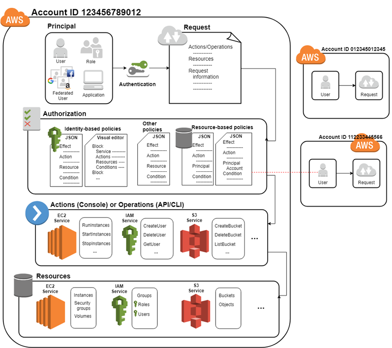

# Theory to Cover

### Cloud9

AWS Cloud9 is a cloud-based integrated development environment (IDE) that lets you write, run, and debug your code with just a browser. It includes a code editor, debugger, and terminal. Cloud9 comes prepackaged with essential tools for popular programming languages, including JavaScript, Python, PHP, and more, so you don’t need to install files or configure your development machine to start new projects. Since your Cloud9 IDE is cloud-based, you can work on your projects from your office, home, or anywhere using an internet-connected machine. Cloud9 also provides a seamless experience for developing serverless applications enabling you to easily define resources, debug, and switch between local and remote execution of serverless applications. With Cloud9, you can quickly share your development environment with your team, enabling you to pair program and track each other's inputs in real time.

### t3.small etc.

This is an example for an instance type. t3 is the newer version of t2, whereby the `bigger` the more CPU and RAM are defined for the instances.

Besides t-type instances there are much more variants available: <https://aws.amazon.com/ec2/instance-types/>

See:
- <https://aws.amazon.com/ec2/instance-types/t2/>
- <https://aws.amazon.com/ec2/instance-types/t3/>

### Tools

- `kubectl` is the command line tool which lets you control Kubernetes clusters. For configuration, kubectl looks for a file named config in the $HOME/.kube directory. You can specify other kubeconfig files by setting the KUBECONFIG environment variable or by setting the --kubeconfig flag.
- `awscli` is the AWS Command Line Interface (CLI). It is a unified tool to manage your AWS services. <http://docs.aws.amazon.com/cli/latest/reference/>
- 

### IAM




Resources
The user, group, role, policy, and identity provider objects that are stored in IAM. As with other AWS services, you can add, edit, and remove resources from IAM.

Identities
The IAM resource objects that are used to identify and group. You can attach a policy to an IAM identity. These include users, groups, and roles.

Entities
The IAM resource objects that AWS uses for authentication. These include IAM users, federated users, and assumed IAM roles.

Principals
A person or application that uses the AWS account root user, an IAM user, or an IAM role to sign in and make requests to AWS.

- ARN
- IAM
  - Create Users
  - Policies
  - Roles
  - Trust
  - Instance Profiles
  - Permissions
- STS
  - get-caller-identity
- KMS
  - Secrets Encryption
  
<https://aws.amazon.com/de/premiumsupport/knowledge-center/iam-assume-role-cli/>

## ARN

Amazon Resource Names (ARNs) uniquely identify AWS resources. We require an ARN when you need to specify a resource unambiguously across all of AWS, such as in IAM policies, Amazon Relational Database Service (Amazon RDS) tags, and API calls.

The following are the general formats for ARNs. The specific formats depend on the resource. To use an ARN, replace the italicized text with the resource-specific information. Be aware that the ARNs for some resources omit the Region, the account ID, or both the Region and the account ID.

```text
arn:partition:service:region:account-id:resource-id
arn:partition:service:region:account-id:resource-type/resource-id
arn:partition:service:region:account-id:resource-type:resource-id
```

## How do I assume an IAM role using the AWS CLI?

aws iam create-user --user-name Bob
aws iam create-policy
aws iam attach-user-policy
aws iam create-role
aws iam attach-role-policy
aws iam create-access-key
