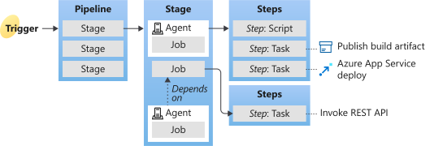

# Theory

- [Theory](#theory)
  - [Services - Container](#services---container)
    - [AKS](#aks)
    - [App Service](#app-service)
    - [Container Instances](#container-instances)
    - [Service Fabric](#service-fabric)
    - [Container Registry](#container-registry)
  - [Services - Serverless](#services---serverless)
    - [Functions](#functions)
  - [Services - DevOps](#services---devops)
    - [DevOps](#devops)
    - [DevOps Organization](#devops-organization)
    - [Project](#project)
    - [Pipeline](#pipeline)
      - [Continuous delivery](#continuous-delivery)
      - [Continuous integration](#continuous-integration)
      - [Pipeline Definition](#pipeline-definition)
  - [Misc Knowledge, Tools and Services](#misc-knowledge-tools-and-services)
    - [Cloud Shell](#cloud-shell)
    - [Resource Group](#resource-group)
    - [Personal Access Token](#personal-access-token)

This document covers most of the technologies and Azure services used within the CI/CD Pipelining Lab on Azure. Lot's of links for more in depth information are given, whereby the potentially most relevant one is this: [Azure Command-Line Interface (CLI) documentation](https://docs.microsoft.com/en-us/cli/azure/?view=azure-cli-latest).

## Services - Container

### AKS

Azure Kubernetes Service (AKS) makes it simple to deploy a managed Kubernetes cluster in Azure. AKS reduces the complexity and operational overhead 1of managing Kubernetes by offloading much of that responsibility to Azure. As a hosted Kubernetes service, Azure handles critical tasks like health monitoring and maintenance for you. The Kubernetes masters are managed by Azure. You only manage and maintain the agent nodes. As a managed Kubernetes service, AKS is free - you only pay for the agent nodes within your clusters, not for the masters.

You can create an AKS cluster in the Azure portal, with the Azure CLI, or template driven deployment options such as Resource Manager templates and Terraform. When you deploy an AKS cluster, the Kubernetes master and all nodes are deployed and configured for you. Additional features such as advanced networking, Azure Active Directory integration, and monitoring can also be configured during the deployment process. Windows Server containers are supported in AKS.

Link: <https://docs.microsoft.com/en-us/azure/aks/intro-kubernetes>

### App Service

Azure App Service enables you to build and host web apps, mobile back ends, and RESTful APIs in the programming language of your choice without managing infrastructure. It offers auto-scaling and high availability, supports both Windows and Linux, and enables automated deployments from GitHub, Azure DevOps, or any Git repo. 

Link: <https://docs.microsoft.com/en-in/azure/app-service/>

### Container Instances

Run Docker containers on-demand in a managed, serverless Azure environment. Azure Container Instances is a solution for any scenario that can operate in isolated containers, without orchestration. Run event-driven applications, quickly deploy from your container development pipelines, and run data processing and build jobs.

Execute a command similar to the following to start a container instance. Set a --dns-name-label value that's unique within the Azure region where you create the instance.

```sh
az container create --resource-group myResourceGroup --name mycontainer --image mcr.microsoft.com/azuredocs/aci-helloworld --dns-name-label aci-demo --ports 80
```

Check the status

```sh
az container show --resource-group myResourceGroup --name mycontainer --query "{FQDN:ipAddress.fqdn,ProvisioningState:provisioningState}" --out table
```

It should return something like this:

```sh
FQDN                               ProvisioningState
---------------------------------  -------------------
aci-demo.eastus.azurecontainer.io  Succeeded
```

If the container's ProvisioningState is Succeeded, go to its FQDN in your browser. If you see a web page similar to the following, congratulations! You've successfully deployed an application running in a Docker container to Azure.

Link: <https://docs.microsoft.com/en-in/azure/container-instances/>

### Service Fabric

Azure Service Fabric is a distributed systems platform that makes it easy to package, deploy, and manage scalable and reliable microservices and containers. Service Fabric also addresses the significant challenges in developing and managing cloud native applications.

A key differentiator of Service Fabric is its strong focus on building stateful services. You can use the Service Fabric programming model or run containerized stateful services written in any language or code. You can create Service Fabric clusters anywhere, including Windows Server and Linux on premises and other public clouds, in addition to Azure.

Service Fabric is Microsoft's container orchestrator for deploying and managing microservices across a cluster of machines.

Link: <https://docs.microsoft.com/en-in/azure/service-fabric/>

### Container Registry

Azure Container Registry is a managed, private Docker registry service based on the open-source Docker Registry 2.0. Create and maintain Azure container registries to store and manage your private Docker container images and related artifacts.

Use Azure container registries with your existing container development and deployment pipelines, or use Azure Container Registry Tasks to build container images in Azure. Build on demand, or fully automate builds with triggers such as source code commits and base image updates.

Link: <https://docs.microsoft.com/en-in/azure/container-registry/>

## Services - Serverless

### Functions

Azure Functions allows you to run small pieces of code (called "functions") without worrying about application infrastructure. With Azure Functions, the cloud infrastructure provides all the up-to-date servers you need to keep your application running at scale.

A function is "triggered" by a specific type of event. Supported triggers include responding to changes in data, responding to messages, running on a schedule, or as the result of an HTTP request.

While you can always code directly against a myriad of services, integrating with other services is streamlined by using bindings. Bindings give you declarative access to a wide variety of Azure and third-party services.

Some key features of Azure Functions include:

- Serverless applications: Functions allow you to develop serverless applications on Microsoft Azure.
- Choice of language: Write functions using your choice of C#, Java, JavaScript, Python, and PowerShell.
- Bring your own dependencies: Functions supports NuGet and NPM, giving you access to your favorite libraries.
- Integrated security: Protect HTTP-triggered functions with OAuth providers such as Azure Active Directory, Facebook, Google, Twitter, and Microsoft Account.
- Simplified integration: Easily integrate with Azure services and software-as-a-service (SaaS) offerings.
- Flexible development: Set up continuous integration and deploy your code through GitHub, Azure DevOps Services, and other supported development tools.
- Stateful serverless architecture: Orchestrate serverless applications with Durable Functions.
- Open-source: The Functions runtime is open-source and available on GitHub.

Link: <https://docs.microsoft.com/en-in/azure/azure-functions/>

## Services - DevOps

### DevOps

Azure DevOps provides developer services to support teams to plan work, collaborate on code development, and build and deploy applications. Developers can work in the cloud using Azure DevOps Services or on-premises using Azure DevOps Server. Azure DevOps Server was formerly named Visual Studio Team Foundation Server (TFS).

Azure DevOps provides integrated features that you can access through your web browser or IDE client. You can use one or more of the following services based on your business needs:

- Azure Repos provides Git repositories or Team Foundation Version Control (TFVC) for source control of your code
- Azure Pipelines provides build and release services to support continuous integration and delivery of your apps
- Azure Boards delivers a suite of Agile tools to support planning and tracking work, code defects, and issues using Kanban and Scrum methods
- Azure Test Plans provides several tools to test your apps, including manual/exploratory testing and continuous testing
- Azure Artifacts allows teams to share Maven, npm, and NuGet packages from public and private sources and integrate package sharing into your CI/CD pipelines

You can also use collaboration tools such as:

- Customizable team dashboards with configurable widgets to share information, progress, and trends
- Built-in wikis for sharing information
- Configurable notifications

Azure DevOps supports adding extensions and integrating with other popular services, such as: Campfire, Slack, Trello, UserVoice, and more, and developing your own custom extensions.

Link: <https://docs.microsoft.com/en-us/azure/devops/?view=azure-devops>

### DevOps Organization

With an organization, you gain access to the platform in which you can do the following tasks:

- Collaborate with others to develop applications by using our cloud service
- Plan and track your work and code defects and issues
- Set up continuous integration and deployment
- Integrate with other services by using service hooks
- Obtain additional features and extensions
- Create one or more projects to segment work.

Link: <https://docs.microsoft.com/en-us/azure/devops/organizations/accounts/organization-management?view=azure-devops>

### Project

A project provides a repository for source code and a place for users to plan, track progress, and collaborate on building software solutions. A project represents a fundamental container where data is stored when added to Azure DevOps.

Link: <https://docs.microsoft.com/en-us/azure/devops/organizations/projects/about-projects?view=azure-devops>

### Pipeline

Azure Pipelines is a cloud service that you can use to automatically build and test your code project and make it available to other users. It works with just about any language or project type.

Azure Pipelines combines continuous integration (CI) and continuous delivery (CD) to constantly and consistently test and build your code and ship it to any target.



- A trigger tells a Pipeline to run.
- A pipeline is made up of one or more stages. A pipeline can deploy to one or more environments.
- A stage is a way of organizing jobs in a pipeline and each stage can have one or more jobs.
- Each job runs on one agent. A job can also be agentless.
- Each agent runs a job that contains one or more steps.
- A step can be a task or script and is the smallest building block of a pipeline.
- A task is a pre-packaged script that performs an action, such as invoking a REST API or publishing a build artifact.
- An artifact is a collection of files or packages published by a run.

#### Continuous delivery

Continuous delivery (CD) is a process by which code is built, tested, and deployed to one or more test and production stages. Deploying and testing in multiple stages helps drive quality. Continuous integration systems produce deployable artifacts, which includes infrastructure and apps. Automated release pipelines consume these artifacts to release new versions and fixes to existing systems. Monitoring and alerting systems run constantly to drive visibility into the entire CD process. This process ensures that errors are caught often and early.

#### Continuous integration

Continuous integration (CI) is the practice used by development teams to simplify the testing and building of code. CI helps to catch bugs or problems early in the development cycle, which makes them easier and faster to fix. Automated tests and builds are run as part of the CI process. The process can run on a set schedule, whenever code is pushed, or both. Items known as artifacts are produced from CI systems. They're used by the continuous delivery release pipelines to drive automatic deployments.

#### Pipeline Definition

The Pipeline configuration is typically defined within the `azure-pipelines.yml`. Below, a sample pipeline is defined building a container image, pushing it to the registry and deploying it to an AKS cluster:

```yaml
# Deploy to Azure Kubernetes Service
# Build and push image to Azure Container Registry; Deploy to Azure Kubernetes Service
# https://docs.microsoft.com/azure/devops/pipelines/languages/docker

trigger:
- master

resources:
- repo: self

variables:

  # Container registry service connection established during pipeline creation
  dockerRegistryServiceConnection: 'f3b74647-1710-4aa0-abfc-4da499cbc745'
  imageRepository: 'cappsecuploader'
  containerRegistry: 'c1appsecuploaderregistry2.azurecr.io'
  dockerfilePath: '**/Dockerfile'
  tag: '$(Build.BuildId)'
  imagePullSecret: 'c1appsecuploaderregistry2f127-auth'

  # Agent VM image name
  vmImageName: 'ubuntu-latest'
  
stages:
- stage: Build
  displayName: Build stage
  jobs:  
  - job: Build
    displayName: Build
    pool:
      vmImage: $(vmImageName)
    steps:
    - task: Docker@2
      displayName: Build an image
      inputs:
        command: buildAndPush
        repository: $(imageRepository)
        dockerfile: $(dockerfilePath)
        containerRegistry: $(dockerRegistryServiceConnection)
        tags: |
          $(tag)

    - upload: manifests
      artifact: manifests

- stage: Deploy
  displayName: Deploy stage
  dependsOn: Build

  jobs:
  - deployment: Deploy
    displayName: Deploy
    pool:
      vmImage: $(vmImageName)
    environment: 'mawinklerc1appsecuploader-1012.appcluster-default-1871'
    strategy:
      runOnce:
        deploy:
          steps:
          - task: KubernetesManifest@0
            displayName: Create imagePullSecret
            inputs:
              action: createSecret
              secretName: $(imagePullSecret)
              dockerRegistryEndpoint: $(dockerRegistryServiceConnection)

          - task: KubernetesManifest@0
            displayName: Deploy to Kubernetes cluster
            inputs:
              action: deploy
              manifests: |
                $(Pipeline.Workspace)/manifests/deployment.yml
                $(Pipeline.Workspace)/manifests/service.yml
              imagePullSecrets: |
                $(imagePullSecret)
              containers: |
                $(containerRegistry)/$(imageRepository):$(tag)
```

Link: <https://docs.microsoft.com/en-us/azure/devops/pipelines/get-started/what-is-azure-pipelines?view=azure-devops>

## Misc Knowledge, Tools and Services

### Cloud Shell

Azure Cloud Shell is a browser-based shell experience to manage and develop Azure resources.

Cloud Shell offers a browser-accessible, pre-configured shell experience for managing Azure resources without the overhead of installing, versioning, and maintaining a machine yourself.

Cloud Shell provisions machines on a per-request basis and as a result machine state will not persist across sessions. Since Cloud Shell is built for interactive sessions, shells automatically terminate after 20 minutes of shell inactivity.

Azure Cloud Shell runs on Ubuntu 16.04 LTS.

Important to know: The machine that provides your Cloud Shell session is temporary, and it is recycled after your session is inactive for 20 minutes.

Link: <https://docs.microsoft.com/en-in/azure/cloud-shell/>

### Resource Group

A resource group is a container (not a Docker container :-) !) that holds related resources for an Azure solution. The resource group can include all the resources for the solution, or only those resources that you want to manage as a group. You decide how you want to allocate resources to resource groups based on what makes the most sense for your organization. Generally, add resources that share the same lifecycle to the same resource group so you can easily deploy, update, and delete them as a group.

The resource group stores metadata about the resources. Therefore, when you specify a location for the resource group, you are specifying where that metadata is stored. For compliance reasons, you may need to ensure that your data is stored in a particular region.

### Personal Access Token

Based on the permissions of your account you can create a temporary access token with a configurable scope. This token can then be used even within command line sessions. It is called PAT.
