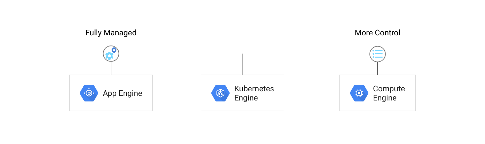
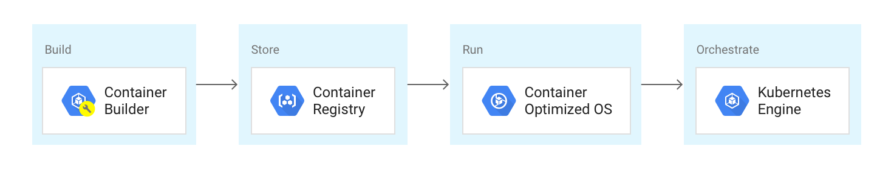

# Theory

- [Theory](#theory)
  - [Services - Containers](#services---containers)
    - [The Google Way](#the-google-way)
    - [GKE](#gke)
      - [Kubernetes Engine Features](#kubernetes-engine-features)
      - [The Complete Container Solution](#the-complete-container-solution)
      - [Security](#security)
      - [Creating a Cluster](#creating-a-cluster)
    - [GCR](#gcr)
  - [Services - Serverless](#services---serverless)
    - [Cloud Run](#cloud-run)
    - [App Engine](#app-engine)
    - [Cloud Functions](#cloud-functions)
    - [Knative](#knative)
  - [Services - DevOps](#services---devops)
    - [Google Cloud resources](#google-cloud-resources)
      - [Accessing resources through services](#accessing-resources-through-services)
      - [Global, regional, and zonal resources](#global-regional-and-zonal-resources)
    - [Project](#project)
    - [Cloud Source Repository](#cloud-source-repository)
    - [Cloud Build](#cloud-build)
    - [Cloud Builders](#cloud-builders)
    - [Google-managed SSL certificate](#google-managed-ssl-certificate)
    - [Build Trigger](#build-trigger)
    - [Build Specification](#build-specification)
  - [Misc Knowledge, Tools and Services](#misc-knowledge-tools-and-services)
    - [Cloud Shell](#cloud-shell)
    - [Ingress](#ingress)

This document covers most of the technologies and GCP services used within the CI/CD Pipelining Lab on Google Cloud. Lot's of links for more in depth information are given. A good starting point in regards documentation is here: <https://cloud.google.com/docs>.

## Services - Containers

### The Google Way

From Gmail to YouTube to Search, everything at Google runs in containers. Containerization allows our development teams to move fast, deploy software efficiently, and operate at an unprecedented scale. Each week, we start over several billion containers. We’ve learned a lot about running containerized workloads in production over the past decade, and we’ve shared this knowledge with the community along the way: from the early days of contributing cgroups to the Linux kernel, to taking designs from our internal tools and open sourcing them as the Kubernetes project. We’ve packaged this expertise into Google Cloud Platform so that developers and businesses of any size can easily tap the latest in container innovation.

### GKE

Kubernetes Engine is fully managed by Google reliability engineers, the ones who know containers the best, ensuring your cluster is highly available and up-to-date. It integrates seamlessly with all GCP services, such as Stackdriver monitoring, diagnostics, and logging; Identity and Access Management; and Google’s best-in-class networking infrastructure.

#### Kubernetes Engine Features

- Managed open-source Kubernetes
- 99.5% SLA, and high availability with integrated multi-zone deployments
- Seamless integration of other GCP services
- Industry leading price per performance
- Flexible & interoperable with your on-premises clusters or other cloud providers
- Google-grade managed-infrastructure

Google Cloud Platform offers you a full spectrum for running your containers. From fully managed environment with Google Cloud Run to cluster management with Kubernetes Engine to roll-it-yourself infrastructure on world-class price-to-performance Google Compute Engine, you can find your ideal solution for running containers on Google Cloud Platform.



#### The Complete Container Solution

It doesn’t stop there. Google Cloud Platform provides the tools you need to use containers from development to production. Cloud Build and Container Registry provide Docker image storage and management, backed by both Google’s high security standards and world-class network. Google’s Container-Optimized OS provides a lightweight, highly secure operating system that comes with the Docker and Kubernetes runtimes pre-installed. All your container management can take place on GCP.



#### Security

The GKE Sandbox provides a second layer of defense between containerized workloads on GKE for enhanced workload security. GKE clusters natively support Kubernetes Network Policy to restrict traffic with pod-level firewall rules. Private clusters in GKE can be restricted to a private endpoint or a public endpoint that only certain address ranges can access.

gVisor is a userspace re-implementation of the Linux kernel API that does not need elevated privileges. In conjunction with a container runtime such as containerd , the userspace kernel re-implements the majority of system calls and services them on behalf of the host kernel. Direct access to the host kernel is limited. See the gVisor architecture guide for detailed information about how this works. From the container's point of view, gVisor is nearly transparent, and does not require any changes to the containerized application.

When you enable GKE Sandbox on a node pool, a sandbox is created for each Pod running on a node in that node pool. In addition, nodes running sandboxed Pods are prevented from accessing other Google Cloud services or cluster metadata.

Each sandbox uses its own userspace kernel. With this in mind, you can make decisions about how to group your containers into Pods, based on the level of isolation you require and the characteristics of your applications.

Link: <https://cloud.google.com/kubernetes-engine/docs/concepts/sandbox-pods>

#### Creating a Cluster

Just a few additional things on GKE

When you create a new cluster, select the release channel for the master. By default, the static channel es selected with the default stable Kubernetes version. If you require for any reason a more recent k8s, you need to select the Release Channel.

Specifically designed for GKE there is a Marketplace called `Application` from which you can directly deploy solutions onto your cluster. There are 100+ different solutions for direct deployment available.

### GCR

Container Registry is a private container image registry that runs on Google Cloud. Container Registry supports Docker Image Manifest V2 and OCI image formats.

You can access Container Registry through secure HTTPS endpoints, which allow you to push, pull, and manage images from any system, VM instance, or your own hardware. Additionally, you can use the Docker credential helper command-line tool to configure Docker to authenticate directly with Container Registry.

Registries in Container Registry are named by the host and project ID. To work with images (for example push, pull, delete) identify the image using the following format:

`HOSTNAME/PROJECT-ID/IMAGE:TAG`

or

`HOSTNAME/PROJECT-ID/IMAGE@IMAGE-DIGEST`

where:

- HOSTNAME is the location where the image is stored:
  - gcr.io currently hosts the images in the United States, but the location may change in the future
  - us.gcr.io hosts the image in the United States, in a separate storage bucket from images hosted by gcr.io
  - eu.gcr.io hosts the images in the European Union
  - asia.gcr.io hosts the images in Asia
  
  These locations correspond to the multi-regions for Cloud Storage storage buckets. When you push an image to a registry with a new hostname, Container Registry creates a storage bucket in the specified multi-region. This bucket is the underlying storage for the registry. Within a project, all registries with the same hostname share one storage bucket.

- PROJECT-ID is your Google Cloud Console project ID. If your project ID contains a colon (:), see Domain-scoped projects below.
- IMAGE is the image's name. It can be different than the image's local name. In the Google Cloud Console, the project's registries are listed by the image name. Each repository can hold multiple images with the same name. For example, it may hold different versions of an image called "quickstart-image".
- adding either :TAG or @IMAGE-DIGEST at the end allows you to distinguish a specific version of the image, but it is also optional. If you don't specify a tag or the digest, Container Registry looks for the image with the default tag latest

## Services - Serverless

### Cloud Run

Cloud Run is a managed compute platform that enables you to run stateless containers that are invocable via web requests or Pub/Sub events. Cloud Run is serverless: it abstracts away all infrastructure management, so you can focus on what matters most — building great applications. It is built from Knative, letting you choose to run your containers either fully managed with Cloud Run, in your Google Kubernetes Engine cluster, or in workloads on-premises with Cloud Run for Anthos.

Effectively, you prepare for the container image build as usual (application code, Dockerfile, etc.) and build it with

```sh
gcloud builds submit --tag gcr.io/PROJECT-ID/helloworld
```

The above will build the image and pushes it to GCR. To deploy it on Cloud Run, simply do

```sh
gcloud run deploy --image gcr.io/PROJECT-ID/helloworld --platform managed
```

Quickstart here: <https://cloud.google.com/run/docs/quickstarts/build-and-deploy>

### App Engine

App Engine is a fully managed, serverless platform for developing and hosting web applications at scale. You can choose from several popular languages, libraries, and frameworks to develop your apps, then let App Engine take care of provisioning servers and scaling your app instances based on demand.

The App Engine standard environment is based on container instances running on Google's infrastructure. Containers are preconfigured with one of several available runtimes.

The App Engine standard environment makes it easy to build and deploy an application that runs reliably even under heavy load and with large amounts of data.

Applications run in a secure, sandboxed environment, allowing the App Engine standard environment to distribute requests across multiple servers, and scaling servers to meet traffic demands. Your application runs within its own secure, reliable environment that is independent of the hardware, operating system, or physical location of the server.

An example to get you started if you're willing to try it: <https://cloud.google.com/appengine/docs/standard/python3/quickstart>

### Cloud Functions

Google Cloud Functions is a lightweight compute solution for developers to create single-purpose, stand-alone functions that respond to Cloud events without the need to manage a server or runtime environment.

Example:

```python
def hello_world(request):
    """Responds to any HTTP request.
    Args:
        request (flask.Request): HTTP request object.
    Returns:
        The response text or any set of values that can be turned into a
        Response object using
        `make_response <http://flask.pocoo.org/docs/1.0/api/#flask.Flask.make_response>`.
    """
    request_json = request.get_json()
    if request.args and 'message' in request.args:
        return request.args.get('message')
    elif request_json and 'message' in request_json:
        return request_json['message']
    else:
        return f'Hello World!'
```

When this function is triggered by an HTTP request, it writes a message.

### Knative

Knative (pronounced kay-nay-tiv) extends Kubernetes to provide a set of middleware components that are essential to build modern, source-centric, and container-based applications that can run anywhere: on premises, in the cloud, or even in a third-party data center.

Each of the components under the Knative project attempt to identify common patterns and codify the best practices that are shared by successful, real-world, Kubernetes-based frameworks and applications. Knative components focus on solving mundane but difficult tasks such as:

- Deploying a container
- Routing and managing traffic with blue/green deployment
- Scaling automatically and sizing workloads based on demand
- Binding running services to eventing ecosystems

Developers on Knative can use familiar idioms, languages, and frameworks to deploy functions, applications, or containers workloads.

Links:

- <https://knative.dev/docs/>
- <https://github.com/knative>

## Services - DevOps

### Google Cloud resources

Google Cloud consists of a set of physical assets, such as computers and hard disk drives, and virtual resources, such as virtual machines (VMs), that are contained in Google's data centers around the globe. Each data center location is in a region. Regions are available in Asia, Australia, Europe, North America, and South America. Each region is a collection of zones, which are isolated from each other within the region. Each zone is identified by a name that combines a letter identifier with the name of the region. For example, zone a in the East Asia region is named asia-east1-a.

This distribution of resources provides several benefits, including redundancy in case of failure and reduced latency by locating resources closer to clients. This distribution also introduces some rules about how resources can be used together.

#### Accessing resources through services

In cloud computing, what you might be used to thinking of as software and hardware products, become services. These services provide access to the underlying resources. The list of available Google Cloud services is long, and it keeps growing. When you develop your website or application on Google Cloud, you mix and match these services into combinations that provide the infrastructure you need, and then add your code to enable the scenarios you want to build.

#### Global, regional, and zonal resources

Some resources can be accessed by any other resource, across regions and zones. These global resources include preconfigured disk images, disk snapshots, and networks. Some resources can be accessed only by resources that are located in the same region. These regional resources include static external IP addresses. Other resources can be accessed only by resources that are located in the same zone. These zonal resources include VM instances, their types, and disks.

### Project

Any Google Cloud resources that you allocate and use must belong to a project. You can think of a project as the organizing entity for what you're building. A project is made up of the settings, permissions, and other metadata that describe your applications. Resources within a single project can work together easily, for example by communicating through an internal network, subject to the regions-and-zones rules. A project can't access another project's resources unless you use Shared VPC or VPC Network Peering.

Each Google Cloud project has the following:

- A project name, which you provide.
- A project ID, which you can provide or Google Cloud can provide for you.
- A project number, which Google Cloud provides.

Each project ID is unique across Google Cloud. Once you have created a project, you can delete the project but its ID can never be used again.

When billing is enabled, each project is associated with one billing account. Multiple projects can have their resource usage billed to the same account.

A project serves as a namespace. This means every resource within each project must have a unique name, but you can usually reuse resource names if they are in separate projects. Some resource names must be globally unique. Refer to the documentation for the resource for details.

### Cloud Source Repository

Cloud Source Repositories provides fully featured, private Git repositories hosted on Google Cloud.

You can use Cloud Source Repositories for collaborative, version-controlled development of any app or service, including those that run on App Engine and Compute Engine. If you use Cloud Debugger, you can use Cloud Source Repositories and related tools in the Google Cloud Console to view debugging information alongside your code during app runtime.

If you're familiar with Git, you can get started quickly with Cloud Source Repositories. For example, you can add Cloud Source Repositories to a local Git repository as a remote, or you can connect it to a hosted repository on GitHub or Bitbucket. From a local repository, you can use the standard set of Git commands to interact with the repository in the cloud, including push, pull, clone, and log.

You can create multiple repositories for a single Google Cloud project, allowing you to organize the code associated with your cloud project in whatever way works best for you.

You can connect an existing GitHub or Bitbucket repository to Cloud Source Repositories. Connected repositories are synchronized with Cloud Source Repositories automatically.

### Cloud Build

Cloud Build is a service that executes your builds on Google Cloud Platform infrastructure. Cloud Build can import source code from Google Cloud Storage, Cloud Source Repositories, GitHub, or Bitbucket, execute a build to your specifications, and produce artifacts such as Docker containers or Java archives.

Cloud Build executes your build as a series of build steps, where each build step is run in a Docker container. A build step can do anything that can be done from a container irrespective of the environment. To perform your tasks, you can either use the supported build steps provided by Cloud Build or write your own build steps.

### Cloud Builders

Cloud builders are container images with common languages and tools installed in them. You can configure Cloud Build to run a specific command within the context of these builders.

This page describes the types of builders that you can use with Cloud Build.

<https://cloud.google.com/cloud-build/docs/cloud-builders>

### Google-managed SSL certificate

Managed Certificate is a Custom Resource object created by google. This CRD allows users to automatically acquire an SSL certificate from a Certificate Authority, configure certificate on the load balancer and auto-renew it on time when it’s expired.

The process is super simple and users only need to provide a domain for which they want to obtain a certificate.

### Build Trigger

A Cloud Build trigger automatically starts a build whenever you make any changes to your source code. You can configure the trigger to build your code on any changes to the source repository or only changes that match certain criteria.

Build Triggers are very flexible. You can configure them to build for different stages / environments, you're passing environment variables with them to the pipeline run. Last but not least, you can also create triggers, which are bound to GitHub.

### Build Specification

A build config or specification file contains instructions for Cloud Build to perform tasks based on your specifications. For example, your build config file can contain instructions to build, package, and push Docker images.

The `cloudbuild.yaml` is the default name for a pipeline definition in GCP. It's structure is shown below.

```yaml
steps:
- name: string
  args: [string, string, ...]
  env: [string, string, ...]
  dir: string
  id: string
  waitFor: [string, string, ...]
  entrypoint: string
  secretEnv: string
  volumes: object(Volume)
  timeout: string (Duration format)
- name: string
  ...
- name: string
  ...
timeout: string (Duration format)
queueTtl: string (Duration format)
logsBucket: string
options:
 env: [string, string, ...]
 secretEnv: string
 volumes: object(Volume)
 sourceProvenanceHash: enum(HashType)
 machineType: enum(MachineType)
 diskSizeGb: string (int64 format)
 substitutionOption: enum(SubstitutionOption)
 logStreamingOption: enum(LogStreamingOption)
 logging: enum(LoggingMode)
substitutions: map (key: string, value: string)
tags: [string, string, ...]
secrets: object(Secret)
images:
- [string, string, ...]
artifacts: object (Artifacts)
```

A build step specifies an action that you want Cloud Build to perform. For each build step, Cloud Build executes a docker container as an instance of docker run. Build steps are analogous to commands in a script and provide you with the flexibility of executing arbitrary instructions in your build. If you can package a build tool into a container, Cloud Build can execute it as part of your build. By default, Cloud Build executes all steps of a build serially on the same machine. If you have steps that can run concurrently, use the waitFor option.

You can include one or more build steps in your config file.

Use the steps field in the build config file to specify a build step. Here's a snippet of the kind of configuration you might set in the steps field:

```yaml
steps:
- name: 'gcr.io/cloud-builders/kubectl'
  args: ['set', 'image', 'deployment/mydepl', 'my-image=gcr.io/my-project/myimage']
  env:
  - 'CLOUDSDK_COMPUTE_ZONE=us-east4-b'
  - 'CLOUDSDK_CONTAINER_CLUSTER=my-cluster'
- name: 'gcr.io/cloud-builders/docker'
  args: ['build', '-t', 'gcr.io/my-project-id/myimage', '.']
```

More info here: <https://cloud.google.com/cloud-build/docs/build-config>

## Misc Knowledge, Tools and Services

### Cloud Shell

Google Cloud Shell is an interactive shell environment for Google Cloud Platform that makes it easy for you to learn and experiment with GCP and manage your projects and resources from your web browser.

With Cloud Shell, the Cloud SDK gcloud command-line tool and other utilities you need are pre-installed, fully authenticated, up-to-date, and always available when you need them. Additionally, Cloud Shell comes with a built-in code editor, the ability to launch tutorials and open cloned repositories, and preview functionality to temporarily run web apps on a Cloud Shell virtual machine instance, and more.

When you start Cloud Shell, it provisions a e2-small Google Compute Engine virtual machine running a Debian-based Linux operating system. Cloud Shell instances are provisioned on a per-user, per-session basis. The instance persists while your Cloud Shell session is active; after an hour of inactivity, your session terminates and its VM, discarded. For more on usage quotas, refer to the limitations guide.

With the default Cloud Shell experience, you are allocated with an ephemeral, pre-configured VM and the environment you work with is a Docker container running on that VM. You can also customize your environment automatically on VM boot to ensure that your Cloud Shell instance includes your preferred tools.

Link: <https://cloud.google.com/shell/docs/quickstart>

### Ingress

As per the official definition, Ingress is an *API object that manages external access to the services in a cluster, typically HTTP. Ingress can provide load balancing, SSL termination, and name-based virtual hosting*

One of the main use cases of ingress is, it allows users to access Kubernetes services from outside the Kubernetes cluster.

Ingress has 2 parts, ingress controller (there are many controllers) and ingress rules. We create ingress rules and we need a controller that satisfies and process those rules. Only applying ingress rules does not affect the cluster.