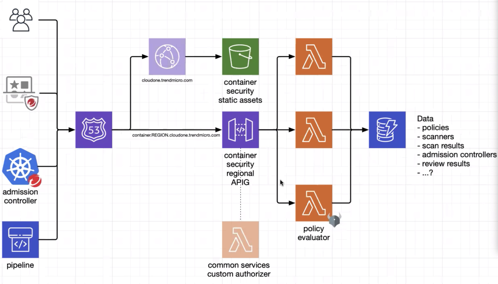

# Container Control

- [Container Control](#container-control)
  - [10 Miles View to Kubernetes Admission Controllers](#10-miles-view-to-kubernetes-admission-controllers)
  - [A closer look at Kubernetes Admission Controllers](#a-closer-look-at-kubernetes-admission-controllers)
  - [Why You Need Admission Controllers](#why-you-need-admission-controllers)
    - [Security](#security)
    - [Governance](#governance)
    - [Configuration management](#configuration-management)
  - [Let's get practical](#lets-get-practical)
  - [Cloud One Container Security](#cloud-one-container-security)
  - [Links](#links)

## 10 Miles View to Kubernetes Admission Controllers

An admission controller is a piece of code that intercepts requests to the Kubernetes API server prior to persistence of the object, but after the request is authenticated and authorized. The controllers are compiled into the kube-apiserver binary, and may only be configured by the cluster administrator. There are two special controllers: MutatingAdmissionWebhook and ValidatingAdmissionWebhook. These execute the mutating and validating (respectively) admission control webhooks which are configured in the API.

## A closer look at Kubernetes Admission Controllers

In a nutshell, Kubernetes admission controllers are plugins that govern and enforce how the cluster is used. They can be thought of as a gatekeeper that intercept (authenticated) API requests and may change the request object or deny the request altogether. The admission control process has two phases: the mutating phase is executed first, followed by the validating phase. Consequently, admission controllers can act as mutating or validating controllers or as a combination of both. For example, the LimitRanger admission controller can augment pods with default resource requests and limits (mutating phase), as well as verify that pods with explicitly set resource requirements do not exceed the per-namespace limits specified in the LimitRange object (validating phase).


It is worth noting that some aspects of Kubernetes’ operation that many users would consider built-in are in fact governed by admission controllers. For example, when a namespace is deleted and subsequently enters the Terminating state, the NamespaceLifecycle admission controller is what prevents any new objects from being created in this namespace.

Among the more than 30 admission controllers shipped with Kubernetes, two take a special role because of their nearly limitless flexibility - `ValidatingAdmissionWebhooks` and `MutatingAdmissionWebhooks`. We will examine these two admission controllers closely, as they do not implement any policy decision logic themselves. Instead, the respective action is obtained from a REST endpoint (a webhook) of a service running inside the cluster. This approach decouples the admission controller logic from the Kubernetes API server, thus allowing users to implement custom logic to be executed whenever resources are created, updated, or deleted in a Kubernetes cluster.

The difference between the two kinds of admission controller webhooks is pretty much self-explanatory: mutating admission webhooks may mutate the objects, while validating admission webhooks may not. However, even a mutating admission webhook can reject requests and thus act in a validating fashion. Validating admission webhooks have two main advantages over mutating ones: first, for security reasons it might be desirable to disable the MutatingAdmissionWebhook admission controller (or apply stricter RBAC restrictions as to who may create MutatingWebhookConfiguration objects) because of its potentially confusing or even dangerous side effects. Second, as shown in the previous diagram, validating admission controllers (and thus webhooks) are run after any mutating ones. As a result, whatever request object a validating webhook sees is the final version that would be persisted to etcd.

The set of enabled admission controllers is configured by passing a flag to the Kubernetes API server.

Kubernetes recommends the following admission controllers to be enabled by default.

```shell
--enable-admission-plugins=NamespaceLifecycle,LimitRanger,ServiceAccount,DefaultStorageClass,DefaultTolerationSeconds,MutatingAdmissionWebhook,ValidatingAdmissionWebhook,Priority,ResourceQuota,PodSecurityPolicy
```

The complete list of admission controllers with their descriptions can be found in the official Kubernetes reference <https://kubernetes.io/docs/reference/access-authn-authz/admission-controllers/#what-does-each-admission-controller-do>. This discussion will focus only on the webhook-based admission controllers.

## Why You Need Admission Controllers

### Security

Admission controllers can increase security by mandating a reasonable security baseline across an entire namespace or cluster. The built-in PodSecurityPolicy admission controller is perhaps the most prominent example; it can be used for disallowing containers from running as root or making sure the container’s root filesystem is always mounted read-only, for example. Further use cases that can be realized by custom, webhook-based admission controllers include:

- Allow pulling images only from specific registries known to the enterprise, while denying unknown image registries.
- Reject deployments that do not meet security standards. For example, containers using the privileged flag can circumvent a lot of security checks. This risk could be mitigated by a webhook-based admission controller that either rejects such deployments (validating) or overrides the privileged flag, setting it to false.

### Governance

Admission controllers allow you to enforce the adherence to certain practices such as having good labels, annotations, resource limits, or other settings. Some of the common scenarios include:

- Enforce label validation on different objects to ensure proper labels are being used for various objects, such as every object being assigned to a team or project, or every deployment specifying an app label.
- Automatically add annotations to objects, such as attributing the correct cost center for a “dev” deployment resource.

### Configuration management

Admission controllers allow you to validate the configuration of the objects running in the cluster and prevent any obvious misconfigurations from hitting your cluster. Admission controllers can be useful in detecting and fixing images deployed without semantic tags, such as by:

- automatically adding resource limits or validating resource limits,
- ensuring reasonable labels are added to pods, or
- ensuring image references used in production deployments are not using the latest tags, or tags with a -dev suffix.

In this way, admission controllers and policy management help make sure that applications stay in compliance within an ever-changing landscape of controls.

## Let's get practical

An Admission Controller Webhook is triggered when a Kubernetes resource (or resources) is created, modified or deleted. Essentially a HTTP request is sent to a specified Kubernetes Service in a namespace which returns a JSON response. Depending on that response an action is taken.

There are two categories of Admission Controllers, Validating and Mutating. A Validating Admission Controller validates the incoming request and returns a binary response, yes or no based on custom logic. An example can be that if a Pod resource doesn’t have certain labels the request is rejected with a message on why. A Mutating Admission Controller modifies the incoming request based on custom logic. An example can be that if an Ingress resource doesn’t have the correct annotations, the correct annotations will be added and the resource will be admitted.

With the above scenarios Admission Controllers can be very powerful and give very granular control over what goes in or out of a Kubernetes Cluster. Now let’s dive in.

An example:

```yaml
kind: ValidatingWebhookConfiguration
apiVersion: admissionregistration.k8s.io/v1beta1
metadata:
name: opa-validating-webhook
webhooks:
- name: validating-webhook.openpolicyagent.org
    namespaceSelector:
    matchExpressions:
    - key: openpolicyagent.org/webhook
        operator: NotIn
        values:
        - ignore
    rules:
    - operations: ["CREATE", "UPDATE"]
        apiGroups: ["*"]
        apiVersions: ["*"]
        resources: ["*"]
    clientConfig:
    caBundle: "{{ cacrt.stdout }}"
    service:
        namespace: opa
        name: opa
```

To deploy the webhook, simply do the usual

```shell
kubectl apply -f opa/webhook-configuration.yaml
```

The above example will ensure, that everytime a `CREATE` or `UPDATE` within any of the available `apiGroups`, `apiVersions` on any `resources`, the service within the namespace `opa` and the name `opa` is called. The service will then check all the given information of that request and will answer back with an `allow` or `deny`.

A very simple logic could be the following:

```yaml
deny[msg] {
    input.request.kind.kind == "Pod"
    image := input.request.object.spec.containers[_].image
    not startswith(image, "regprod.internal.corp.com/")
    msg := sprintf("Image is not from our trusted registry: %v", [image])
}
```

With this logic, our admission logic would reject any pod to be deployed on our cluster, when it is not pulled from the registry `regprod.internal.corp.com`. Cool, or?

## Cloud One Container Security

You might wonder, what all the above has to do with Cloud One...

So, the answer is quite easy - Container Security registeres a service as a validating webhook, whereby the policies the user did create within the Cloud One console are evaluated by a some Lambdas and a built-in Open Policy Agent.



Effectively, our solution creates a policy management frontent and integrates with kubernetes via the designated interfaces.

## Links

- <https://kubernetes.io/blog/2019/03/21/a-guide-to-kubernetes-admission-controllers/>
- <https://kubernetes.io/docs/reference/access-authn-authz/admission-controllers/#what-does-each-admission-controller-do>
- <https://www.openpolicyagent.org/>
